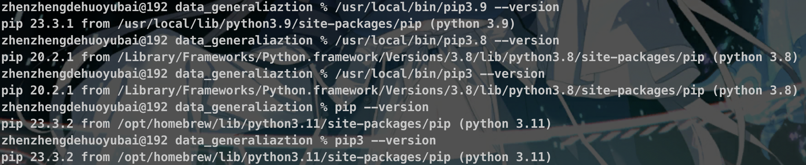
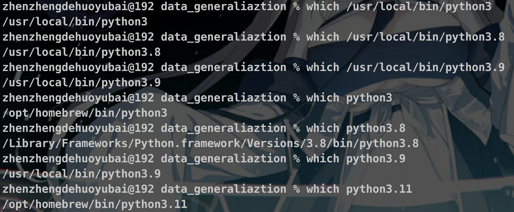

1. [解决”Failed to connect to raw.githubusercontent.com“报错](https://www.guyuehome.com/37844) [原文链接](https://blog.csdn.net/weixin_44293949/article/details/121863559)

2. [北大clash安装](https://189854.xyz/verify) [指北](https://890535.xyz/blog/walless/2020/05/28/manual.html)

3. [git安装](https://git-scm.com/downloads)

4. [VScode安装](https://code.visualstudio.com/ )

5. [Neat_Reader在线](https://www.neat-reader.cn/webapp)

6. [Unity资源商店](http://assetstore.unity.com/)

7. Rsync同步：rsync -av --delete <源目录> <目标目录>

8. 查看Mac SSD损耗：smartctl -s on disk0 -a

9. [alias起别名](https://www.runoob.com/linux/linux-comm-alias.html)

10. [同时启用ros1和ros2](https://www.guyuehome.com/35421)

11. ros2安装：注意ubuntu版本，以及不要装rolling，因为这是开发版本

12. 禁用MacOS的Gatekeeper安全功能（阻止未认证的应用执行）：sudo spctl --master-disable；启用：sudo spctl --master-enable

13. run the x86_64 version using the Rosetta 2 emulator：arch -x86_64 /bin/zsh --login

14. 分布积分表格法：https://gsy00517.github.io/calculus20191007184856/

15. 关于 Conda 版本 https://github.com/randy3k/radian/issues/398

16. 小时百科（数理知识，挺全的），有关于基底的内容 https://wuli.wiki/online/

17. 理解傅里叶变换 https://kaizhao.net/blog/fourier 这个博客里还有一些生成模型的东西

18. 泰勒展开的收敛圆与复数的关系 https://zhihu.com/tardis/zm/art/53921487?source_id=1003

19. 函数逼近 https://spaces.ac.cn/archives/4187

20. 施密特正交化、Legendre 多项式 https://zhuanlan.zhihu.com/p/352724194

21. Github clone GFW：ssh://git@ssh.github.com:443/...

22. git submodule 参考资料：https://iphysresearch.github.io/blog/post/programing/git/git_submodule/

23. git submodule 忘记 recursive：git submodule init + git submodule update

24. Ubuntu 配置 ssh：https://www.cyberciti.biz/faq/ubuntu-linux-install-openssh-server/

25. 电路绘制：schemdraw

26. 托福网址：https://toefl.neea.cn/

27. homebrew架构切换：https://github.com/orgs/Homebrew/discussions/3223、https://zhuanlan.zhihu.com/p/341831809

28. curl: (7) Failed to connect to raw.githubusercontent.com port 443：https://stackoverflow.com/questions/29910217/homebrew-installation-on-mac-os-x-failed-to-connect-to-raw-githubusercontent-com

29. 目前电脑中的 pip 版本（不包括虚拟环境中的）：

    

30. 目前电脑中的 Python 版本（不包括虚拟环境中的）：

    

31. conda 虚拟环境配置：https://conda.io/projects/conda/en/latest/user-guide/tasks/manage-environments.html

32. find . -name file.txt

33. Conda 代理配置：https://zhuanlan.zhihu.com/p/419431018，注意用127.0.0.1时前面不要加http://，端口号为本机代理端口，如 7890

34. 允许安装来历不明的应用：sudo spctl --master-disable

35. homebrew不同架构：abrew\xbrew

36. Ubuntu ssh 配置：https://blog.51cto.com/u_14990501/6140603

37. 将.plist文件转化为.xml：plutil -convert xml1 -o output.xml input.plist

38. Ubuntu 空间清理：

    - How to Free up Disk Space in Ubuntu_ – Its Linux FOSS
      https://itslinuxfoss.com/free-up-disk-space-ubuntu/
    - How to Find Duplicate Files in Linux and Remove Them
      https://itsfoss.com/find-duplicate-files-linux/

39. 使 .gitignore 立即生效：

    git rm -rf --cached .
    git add . 

40. 特殊 Unicode 字符：

    http://huzongyu.mygamesonline.org/unicode-tools/unicode.html

    https://zhuanlan.zhihu.com/p/545309061

41. Error running install script for optional dependency:"/Users/zhenzhengdehuoyubi/Desktop/Software/code/api/node modules/cpu-features: Command failed.：https://github.com/kelektiv/node.bcrypt.js/issues/1018
